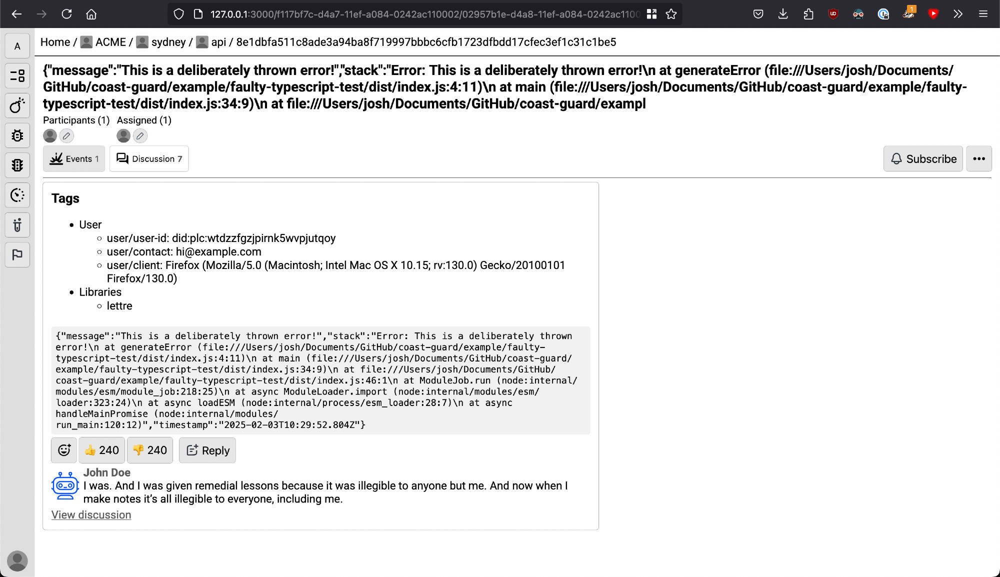

*work in progress*

# Coastguard
With the concern a handful of companies collecting massive amounts of diagnostic information, which can contain lots of information about the user, their device, their activity, etc. Coastguard started as a way for developers to independently store and manage their error data and has evolved from there.

Coastguard's core mission:
- Democratize error collection by enabling developers with data governance.
- Detailed observability into infrastructure.
- Ability to create rigorous tests from pre-made tools.

## Running rigorous tests with Coastguard CLI client
### V1 test scripts
This script runs basic health checks on a handful of Bluesky APIs. In practical applications, the end-goal is running this in Github Actions/Gitlab CICD and brutally testing applications before clearing them for deployment, or in production, writing test scripts that automatically updates a customer status page. All of this data should report back to the relevant team's Coastguard dashboard.

- [Bluesky health check](/example/tests/req.yaml)

### V2 test scripts (proposed, in-development)
I am working on adding extensions and additional flags to Coastguard test scipts, rather than pure bash. You can see some of that work here:

- [BSFC test](/example//tests/bsfc.yaml)

## Screenshots

# TODO:

- client/npm should be published in the NPM registry under http://npmjs.com/package/coast-guard and dashboard/ should pull the package from the NPM registry
- Implementing V2 test scripts
- [Guard](https://github.com/oracularhades/guard) integration should be upgraded to use middleware to prevent Guard-related issues from happening on developer machines.
- Remove some (small) left-over code from [Rover](https://github.com/lighthouse-search/rover).
